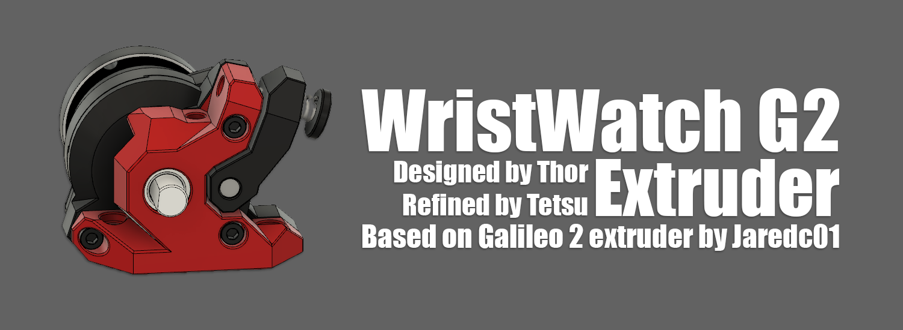

# Wristwatch G2 Extruder



This is WristWatch, a standalone extruder designed by @bythorsthunder
WWG2 is built as an alternative to WristWatch BMG etruder - but it uses Galileo 2 insides for pushing filament. Development started approximately when G2SA was being worked on, but later Thor was kind enough to allow me help him with further refinements of this extruder.

Extruder is made up of 3 parts:  Main Body, Motor Plate and Tension Arm.

Additonal files:

1. Main Body easy for installation on existing toolheads using Orbiter 2 spacing.
2. Rear Plate with Tail:  Additonal mounting point for use with Mini Stealthburner derived cowlings as found [here](../Mini_Stealth_Cowling) or [here](../Experimental_Dual_5015_Toolhead)
3. XOL2.5 Adaptor Plate: Can be used to replace Orbiter 2 adaptor plate in XOL2.5 assemblies


All files can be shared freely but please do not post in public channels for the time being.

## BOM
```
2 M3 Heatset Inserts
1 M3x15
1 M3x25
1 M3x30
1 Galileo 2 Extruder Kit
```
BHCS or SHCS can be used.
